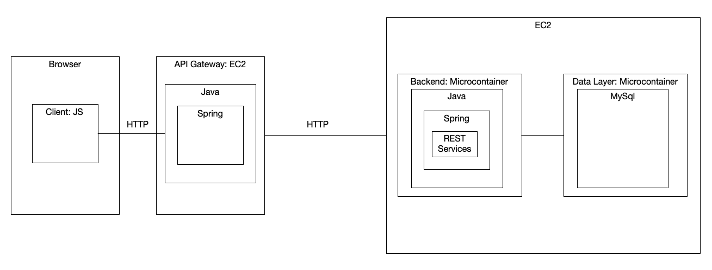

# Proyecto: Arquitectura de Microservicios con API Gateway y Base de Datos en Docker

## Descripción General
Este proyecto utiliza una arquitectura de microservicios desplegada en AWS EC2, con un API Gateway, un backend en Java Spring y una base de datos MySQL. La aplicación cliente en JavaScript (JS) se comunica con el API Gateway, el cual redirige las solicitudes al backend. El backend, alojado en un microcontenedor Docker, se conecta a una base de datos MySQL, también desplegada en un contenedor Docker.

## Tabla de Contenidos
- [Descripción de la Arquitectura](#descripción-de-la-arquitectura)
- [Configuración del Entorno](#configuración-del-entorno)
- [Pasos de Despliegue](#pasos-de-despliegue)
- [Instrucciones de Prueba](#instrucciones-de-prueba)
- [Generación de Imágenes de Docker](#generación-de-imágenes-de-docker)
- [Logs y Ejemplos](#logs-y-ejemplos)

---

## Descripción de la Arquitectura

### Componentes
1. **Cliente (Browser)**
   - Aplicación cliente en JavaScript que interactúa con la API.
   
2. **API Gateway (EC2)**
   - Implementado en **Java** usando **Spring**.
   - Funciona como puerta de enlace, manejando la validación de solicitudes y redirigiéndolas al backend correspondiente.

3. **Backend (Microcontenedor en EC2)**
   - Desarrollado en **Java Spring** con servicios REST.
   - Responsable de la lógica de negocio de la aplicación.
   
4. **Capa de Datos (Microcontenedor en EC2)**
   - Base de datos **MySQL** en un contenedor Docker.
   - Almacena los datos necesarios para la aplicación.

### Diagrama de Arquitectura

---

## Configuración del Entorno

### Requisitos Previos
- Cuenta en AWS para crear instancias EC2.
- **Docker** instalado en las instancias EC2.
- **Java 11** o superior y **Maven** instalados para compilar el código.

### Configuración de EC2
1. **API Gateway**
   - Configurar una instancia EC2 y desplegar el API Gateway en Java Spring.
   - Asegurarse de abrir el puerto HTTP necesario para recibir solicitudes.

2. **Backend y Base de Datos**
   - Crear una instancia EC2 adicional y desplegar en ella dos contenedores Docker:
     - Contenedor para el backend en Java Spring.
     - Contenedor para la base de datos MySQL.

3. **Configuración de Red**
   - Asegurarse de que las instancias EC2 puedan comunicarse entre sí, especialmente los puertos necesarios para MySQL y el API Gateway.

